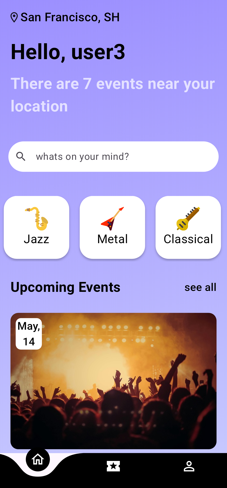
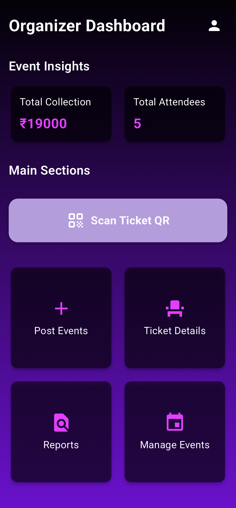
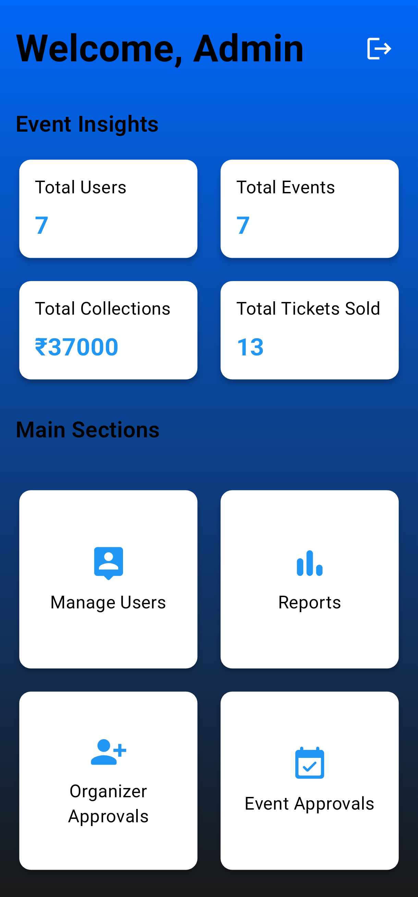

# 🎵🎧 SoundStage – Music Event Ticketing App
[](https://flutter.dev/)
[](https://dart.dev/)
[](https://firebase.google.com/)
[](https://cloud.google.com/)
[](https://cloudinary.com/)
[](https://stripe.com/)
[](https://code.visualstudio.com/)
[](https://github.com/)
[](https://git-scm.com/)<br>
[](https://microsoft.com/windows/)
[](https://www.linux.org/)
[](https://www.android.com/)
[](https://www.apple.com/ios/)
[](src)
[](https://opensource.org/licenses/Apache-2.0)
<br>
&nbsp;

Welcome to SoundStage🎶 an innovative and fully-featured mobile application 📱 designed to streamline the experience of booking, managing, and attending music events. Built using Flutter and Firebase 🔥, it connects customers 🎟️, event organizers 🎤, and admins 👨‍💻 in a seamless, secure 🔒, and scalable 🌐 environment.

&nbsp;
## 🚀 Features

### 🎟️ For Customers
- Register, log in, and manage your profile.
- Browse and filter music events by date, location, or genre.
- Book tickets with secure Stripe payment integration.
- Receive a unique QR code for every ticket for secure event entry.
- View and manage booking history.

### 🎤 For Organizers
- Register and get approved by an admin.
- Upload, edit, or delete events.
- Access real-time stats on ticket sales and attendee analytics.
- Scan QR codes at the venue for secure ticket validation.
- Generate financial reports.

### 🛠️ For Admins
- Approve or reject organizers and their events.
- Manage all user data and event content.
- Generate comprehensive platform-wide financial and user activity reports.


&nbsp;
## 🧱 Tech Stack

| Layer         | Technology |
|---------------|------------|
| Frontend      | Flutter (Dart) |
| Backend       | Firebase (Firestore, Auth), Dart |
| Auth & Security | Firebase Auth, OAuth 2.0, crypto |
| Payments      | Stripe API via `flutter_stripe` |
| QR Code       | `pretty_qr_code`, `mobile_scanner` |
| Media Uploads | Cloudinary |
| Other Packages | `shared_preferences`, `intl`, `random_string`, etc. |


&nbsp;
## 📱 Screenshots

<p align="center">
  &nbsp;
  &nbsp;
  &nbsp;
  &nbsp;
  &nbsp;
  &nbsp;

</p>


&nbsp;
## 🪜 Modules

- **Authentication**
- **Event Management**
- **Ticket Booking and QR Code Generation**
- **Event Analytics and Reporting**
- **Admin Dashboard**


&nbsp;
## 🔧 Installation

1. Clone the repository:

```bash
git clone https://github.com/ameyjoshi0209/sound_stage.git
cd sound_stage
```

2. Install dependencies:

```bash
flutter pub get
```

3. Configure Firebase in the project using your credentials.

4. Run the app:

```bash
flutter run
```

&nbsp;
>_**Note: For comprehensive setup, refer to the [SoundStage Setup Guide](docs/setup.md).**_

&nbsp;
## 📚 Documentation

- [Project Setup Guide](docs/setup.md)
- [User Manual](docs/manual.md)
- [Database Schema](docs/schema.md)
- [System Design Diagrams](docs/design_diagrams.md)


&nbsp;
## 🧠 Future Enhancements

- Add forgot password feature.
- Seat selection interface.
- Notification system for event updates and purchases.
- Language preferences and dark mode support.
- Bug reporting from within the app.


&nbsp;
## 🤝 Contributing

We welcome contributions! 🙌✨ If you'd like to contribute to the project, please fork the repository 🍴, make your changes, and submit a pull request 🔀. Your contributions help make the platform better for everyone! 💡🚀

&nbsp;
## 📖 License

This project is licensed under the [Apache-2.0 license](LICENSE).
