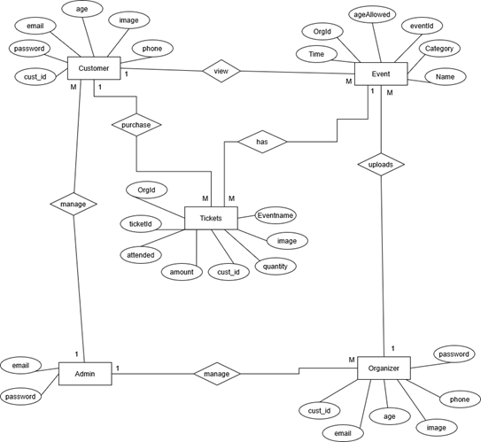

# 🎶 **SoundStage System Design Diagrams** 🎤

This section offers a visual representation of **SoundStage**'s architecture. Below, you'll find various diagrams that showcase key entities, relationships, and interactions within the system. These visuals will help provide a clearer understanding of how different elements of SoundStage integrate and function together. 🔗✨

&nbsp;
&nbsp;

__⚠️ Important Note:__

*__Please note that the diagrams presented in this documentation are based on the current version of the SoundStage application at the time of publication. While every effort has been made to ensure accuracy, there may be discrepancies between these diagrams and future versions of the application. As the system evolves and updates are made, the diagrams may no longer represent the most current architecture or design. 🔄📊__*

*__Due to the nature of the system's continuous development, we will not be updating these diagrams with every change to the app. We recommend referring to the latest release notes 📑 or technical documentation 📝 for the most up-to-date information.__*

*__Thank you for your understanding! 😊🙏__*

&nbsp;
&nbsp;

## 🗂️ **Entity-Relationship Diagram (ERD)**

The **Entity-Relationship Diagram (ERD)** illustrates the relationships between critical entities in the SoundStage application, such as **users**, **events**, **tickets**, and **transactions**. This diagram serves as a blueprint for the **database structure** and shows how data flows within the system. 

📊 **Purpose**: Helps visualize how the entities are connected and the flow of data.

&nbsp;

  

&nbsp;
## 👥 **UML Use Case Diagram**

The **UML Use Case Diagram** highlights the interactions between various **actors** (e.g., users, organizers, and admins) and the system. It outlines the key functionalities available to each actor, providing a clear overview of the system's capabilities.

📌 **Purpose**: Offers a high-level view of how different users interact with the system.

  

---

## 🏷️ **Class Diagram**

The **Class Diagram** provides a detailed view of the **classes** and their relationships within the SoundStage application. This diagram includes **attributes** and **methods** for each class, showing the structure of the codebase and how components interact with one another.

🔧 **Purpose**: Helps developers understand the structure and relationships of different classes in the code.

&nbsp;

  

&nbsp;
## 🔄 **Activity Diagram**

The **Activity Diagram** visualizes the **flow of activities** within the system. It shows how users interact with the application, such as through **user registration**, **event creation**, and **ticket booking**. It offers a step-by-step breakdown of these processes.

🎬 **Purpose**: Demonstrates the sequence of actions users follow while interacting with the system.

&nbsp;

  

&nbsp;
## 🌐 **Deployment Diagram**

The **Deployment Diagram** outlines how the **SoundStage application** is deployed physically, covering servers, databases, and client devices. It provides a high-level overview of the system's structure in a real-world environment.

🌍 **Purpose**: Displays how different components are physically distributed and interact across servers and devices.

&nbsp;

  

&nbsp;
## 🧩 **Module Hierarchy Diagram**

The **Module Hierarchy** diagram shows how the different modules in SoundStage are organized. It clearly visualizes how components are structured, helping us understand how functionalities are encapsulated in each module.

🔍 **Purpose**: Offers insights into the modular design of the system, showing how different components interact.

&nbsp;

  

